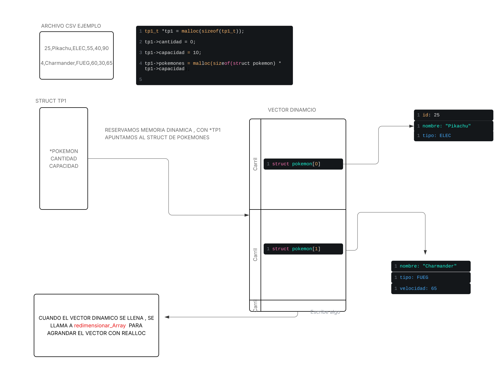

<div align="right">

</div>

#TP1

JERONIMO PEREZ CORDOBA - 111939 - JEROPEREZ42@GMAIL.COM - JEPEREZC@FI.UBA.AR


- Para compilar: 

```bash
make -C TP1-ENUNCIADO
```

Esto compilará el proyecto utilizando el Makefile que fui creando a medida que avanzaba con los requerimientos del tp.

```bash
gcc -std=c11 -Wall -Wextra -Werror -pedantic -O2 -g -Isrc -I. TP1-ENUNCIADO/main.c TP1-ENUNCIADO/src/tp1.c -o tp1
```

- Para ejecutar el programa principal:

```bash
./TP1-ENUNCIADO/tp1
```

- Para correr Valgrind y analizar el uso de memoria:

```bash
valgrind ./TP1-ENUNCIADO/tp1
```

- Para ejecutar los tests creados por mí:

```bash
make -C TP1-ENUNCIADO run-tests
```

- Para limpiar los archivos generados:

```bash
make -C TP1-ENUNCIADO clean
```


##  Funcionamiento

## flujo general del programa : 
    el programa recibe como parametro un archivo CSV con los datos de los pokemones, lee el archivo linea por linea , parsea cada linea y almacena los datos en un vector dinamico de estructuras pokemon_t , luego segun los argumentos recibidos , realiza busquedas, uniones, intersecciones,etc.

-insertar imagen de vector dinamico siendo llenaod , explicandoi en una partecita el uso de malloc 

### Estructuras


- **struct pokemon**  
  Representa a un pokémon individual, con los siguientes campos:
  - `int id;`
  - `char *nombre;`
  - `enum tipo_pokemon tipo;`
  - `int ataque;`
  - `int defensa;`
  - `int velocidad;`

  Esta estructura almacena toda la información relevante de cada pokémon.

- **tp1_t**  
   Estructura opaca que gestiona la colección completa de pokemones y provee funciones para manipularla. Su implementación interna está oculta al usuario.


# Funciones Principales

### 1. 'tp1_leer_archivo'

Es la función que lee el CSV, parsea y almacena los pokemones en memoria dinámica.  
El flujo es: abrir archivo → leer línea → parsear → crear `struct pokemon` → agregar al vector (con `realloc` si es necesario).

<div align="center">

</div>

La función tp1_leer_archivo tiene complejidad O(n²) en el peor caso, ya que por cada pokémon leído se verifica si su id está repetido recorriendo toda la colección cargada hasta el momento.  
El manejo de memoria dinámica (con realloc) es amortizado O(n), pero no afecta el orden final de complejidad.

---

### 2. 'tp1_cantidad'

Es la función encargada de devolver la cantidad de pokemones almacenados en tp1_t.  
Si el puntero recibido es nulo retorna 0.  
Su complejidad es O(1) porque solo consulta un campo (es decir, una variable interna) de la estructura tp1_t llamada cantidad, que siempre mantiene actualizado el número de pokemones almacenados.  
Acceder a un campo de una estructura en C es una operación instantánea, sin importar cuántos elementos haya en la colección.

---

### 3. 'tp1_guardar_archivo'

La función tp1_guardar_archivo guarda los pokemones almacenados en la estructura tp1 en un archivo, el nombre de este es pasado por parámetro.  
Cada pokemon se escribe en una línea, con sus datos separados por comas, la idea es que el formato sea compatible con tp1_leer_archivo.  
Su complejidad es O(n), donde n es la cantidad de pokemones, porque recorre y escribe cada uno.

---

### 4. 'tp1_union'

La función tp1_union recibe (tp1_t *a y tp1_t *b) y devuelve un nuevo tp1 que contiene todos los pokemones de ambas, sin repetir aquellos que tengan el mismo id.  
Internamente, recorre ambas listas ordenadas por id y va agregando cada pokemon a la nueva colección, asegurando que no haya duplicados.  
Su complejidad es O(n + m), donde n es la cantidad de pokemones en la primera colección y m en la segunda.

¿Cómo lo hace?

* Internamente, ambas colecciones están ordenadas por id.
* Se recorre ambas listas al mismo tiempo.
* Si el id es igual en ambos, se agrega solo el de la primera colección y se avanza en ambas.
* Si el id de la primera es menor, se agrega ese y se avanza solo en la primera.
* Si el id de la segunda es menor, se agrega ese y se avanza solo en la segunda.

---
    
### 5. 'tp1_interseccion'

Recibe dos colecciones y devuelve una nueva colección que contiene solo los pokemones que están en ambas (es decir, los que tienen el mismo id en las dos colecciones).  
Su complejidad es O(n + m), donde n y m son las cantidades de pokemones en cada tp1 pasado por parámetro.

¿Cómo lo hace?

* Recorre ambas listas ordenadas por id.
* Solo agrega a la nueva colección los pokemones cuyo id aparece en ambas listas.
* Avanza en ambas listas cuando encuentra un id igual, o solo en la que tiene el id menor si son distintos.

---

### 6. 'tp1_diferencia'

Recibe dos tp1 y devuelve un nuevo tp1 con los pokemones que están en la primer tp1 pero no en el segundo.  
Su complejidad es O(n + m), donde n y m son las cantidades de pokemones en cada tp1 pasado por parámetro.

¿Cómo lo hace?

* Recorre ambas listas ordenadas por id.
* Agrega a la nueva colección los pokemones de la primera lista cuyo id no aparece en la segunda.
* Si encuentra un id igual en ambas, lo saltea (no lo agrega) y avanza en ambas.
* Si el id de la primera es menor, lo agrega y avanza solo en la primera.
* Si el id de la segunda es menor, avanza solo en la segunda.

Las funciones 'tp1_union', 'tp1_interseccion' y 'tp1_diferencia' están estrechamente relacionadas:  
todas utilizan la misma función interna para combinar los tp1, diferenciándose únicamente por el criterio de selección, que se pasa como un puntero a función. Esto permite reutilizar el código y cambiar solo la lógica de qué pokemones agregar en cada caso.

Al principio, implementar las funciones de unión, intersección y diferencia me resultó desafiante, ya que mis primeras versiones recorrían las colecciones de forma anidada, resultando en una complejidad O(n^2). Notaba que intersección y diferencia compartían cierta lógica, pero unión parecía distinta, por lo que inicialmente las implementé por separado.

Sin embargo, en día de la clase de consultas, me di cuenta de que todas podían resolverse eficientemente si ambas colecciones estaban ordenadas por id. Esto me permitió inspirarme en la etapa de "merge" de mergesort y crear una función genérica interna (combinar_tp1) que recorre ambas listas en paralelo en O(n + m), aplicando un criterio de selección pasado como puntero a función. Así, logré unificar las tres operaciones en una sola función eficiente y reutilizable.

---

### 7. 'tp1_buscar_nombre'

Busca un pokémon dentro de la colección representada por tp1_t cuyo nombre coincida exactamente con el nombre pasado por parámetro.  
Se recibe por parámetro el tp1 y el nombre a buscar en tp1.  
Su complejidad es O(n), ya que en el peor caso se debe recorrer todos los pokemones para ver si el nombre está.

---

### 8. 'tp1_buscar_id'

Busca un pokemon dentro de tp1 cuyo campo id coincida exactamente con el valor pasado por parámetro.  
Recibe por parámetros (tp1_t *tp) y un número entero con el id a buscar (int id).

Ya que están ordenados, gracias a la combinación de una función auxiliar merge_sort con tp1_leer_archivo, aplico búsqueda binaria, pasando estos parámetros (tp1_t *tp, int id, size_t inicio, size_t fin), así logro obtener una complejidad de O(log n), donde n es la cantidad de pokemones en tp1.

---

### 9. 'tp1_con_cada_pokemon'
   El objetivo de esta funcion es aplicarle una funcion(f) a cada pokemon del tp1, en orde de ir.
   La funcion se detieene cuando f devuelve false o se terminan los pokemones , lo interesante de esto es que f puede ser lo que nosotros queramos , generando asi , maneras infinitas de manejar y modificar a los pokemones 
   Su complejidad es O(n), donde n es la cantidad de pokemones en tp1.


---